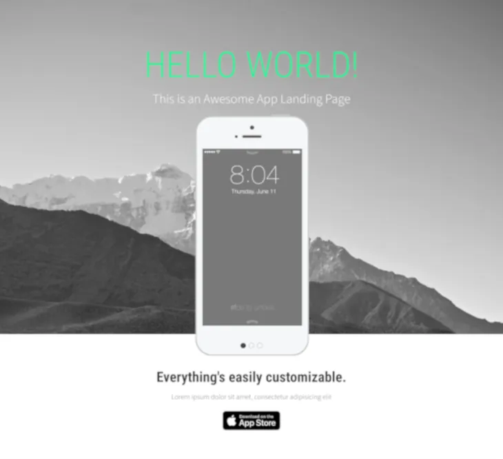

# Landy - Bootstrap 5 Edition - Website Template

A clean, modern, and fully responsive App Landing Page template, refactored and modernized to comply with **Bootstrap 5.3+**.

Originally designed for Bootstrap 3, this version has been overhauled to eliminate legacy dependencies, adopt modern CSS/JS standards, and improve performance.

Developed and maintained by **Binh Nguyen** ([binhnguyensoft.com](https://binhnguyensoft.com)).  
Based on the original [Landy template](https://dribbble.com/shots/1409072-Landy-HTML-Template) by [Paolo Tripodi](https://dribbble.com/paolotripodi).


## Live Preview

[Click here to view Live Demo](https://apps.binhnguyensoft.com/demos/web-templates/landy-bootstrap5/)

### Live examples using this template

[Shortcuts In Menu Bar](https://shortcutsinmenubar.binhnguyensoft.com/)
[English For Kids](https://apps.binhnguyensoft.com/englishforkids/)

## Screenshot



## Key Improvements in Bootstrap 5 Edition

* **Zero jQuery Dependency:** Rewritten completely in native Vanilla JavaScript (ES6+).
* **Modern Bootstrap 5 Architecture:** Fully adapted to the Bootstrap 5 Grid system, Flexbox utilities, and modern navbar structure.
* **Native Smooth Scrolling:** Replaced legacy jQuery plugins with native HTML5 anchor navigation (`scroll-margin-top`) and CSS smooth scroll.
* **Updated Google Fonts (Source Sans 3):** Upgraded legacy font imports to modern Google Fonts standards, replacing the deprecated *Source Sans Pro* with **Source Sans 3** alongside **Roboto Condensed** with clean font-weight variants.
* **Bootstrap Icons:** Integrated official SVG-based Bootstrap Icons replacing obsolete icon fonts.
* **Lightweight & Fast:** Optimized asset loading with zero unnecessary script executions.

## Project Structure

```
landy/
├── css/
│   ├── bootstrap.min.css        # Bootstrap 5 compiled CSS
│   ├── bootstrap-icons.min.css  # Bootstrap Icons CSS
│   └── fonts/                   # Fonts for Bootstrap Icons
│   ├── style.css                # Custom template overrides
├── js/
│   ├── bootstrap.bundle.min.js  # Bootstrap 5 JavaScript bundle
│   └── scripts.js               # Custom JS for parallax & scroll interactions
├── img/
│   ├── screenshots/             # App preview screens
│   ├── iphone-front.png         # iPhone frame mockup
│   └── *.jpg / *.svg            # Background assets & App Store badge
├── index.html                   # Main page
├── LICENSE                      # License
└── README.md                    # Project documentation
```

## License

This project is open-source and available under the MIT License.

You are free to use, modify, and distribute this template for both personal and commercial projects.
